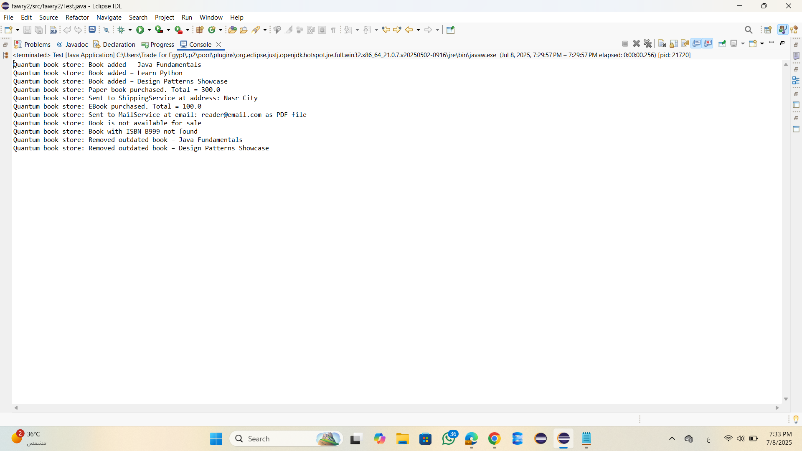

      Quantum Bookstore Project ( Using Java)
The system supports three types of books:
- PaperBook: Has a stock count and can be shipped to a customer address.
- EBook: Delivered via email and includes a file type such as PDF or EPUB.
- ShowcaseBook: Demo books that are not available for sale.
All print statements are prefixed with: "Quantum book store:"
Features:-
- Add books to the inventory with the following details:
  - ISBN
  - Title
  - Author
  - Year of publication
  - Price

- Remove outdated books based on a specific number of years
- Buy a single book by providing:
  - ISBN
  - Quantity
  - Customer email
  - Shipping address

The system behaves differently depending on the book type:
- PaperBook: Reduces stock and simulates shipping
- EBook: Simulates sending a file by email
- ShowcaseBook: Cannot be purchased
Structure:-
- Book (abstract class): Shared base for all book types
- PaperBook, EBook, ShowcaseBook: Extend Book with their own behavior
- Inventory: Manages the collection of books and handles all operations
- Test: Contains test scenarios to demonstrate the system's functionality

Test Cases Covered:-
- Buying available books (paper and ebooks)
- Trying to buy unavailable or demo books
- Removing outdated books based on publication year
- Handling invalid ISBNs and large quantities
- Printing accurate totals and output messages

 Tools Used
- Java 21
- Eclipse IDE
## Screenshots

# 1. Application Running in Eclipse

# 2. Console Output After Purchase

